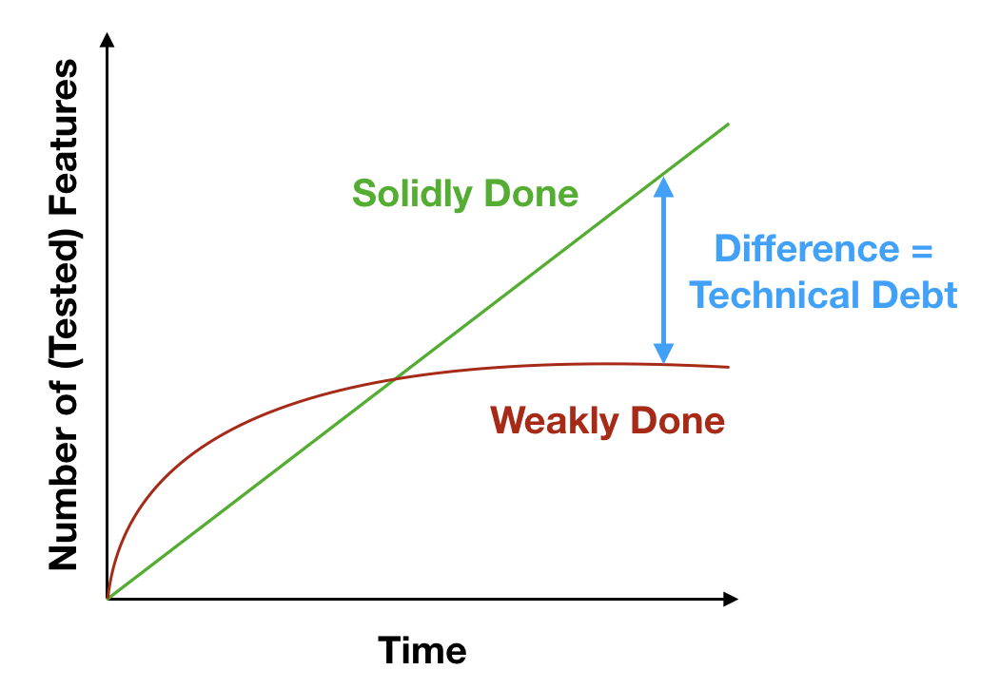
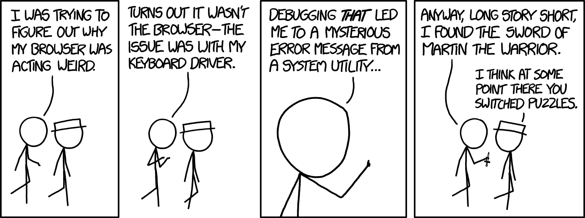

# 1. Good code
* "Good code is like a good joke: You should not have to explain it."

We all do our best to write the best possible code. We try to have our code maintainable, flexible, readable... But what if we can't even make the difference between bad and good code. What are the indicator for a bad design that will make our code not maintainable, not flexible ...
If we leave our code unclean the consequence can be grave and lead to clients distrusting the product as credibility is lost for the product quality.

In this section we will explore how to identify bad code and what are the inconvenient of bad code.
## 1.1. Technical debt
Before we get into the meat, We first need to explain what happens on the long term when dealing with bad code. Some may ask why bother? To answer the question we need to first understand what is technical debt.


Technical debt is an analogy to loaning money to the bank. You get the money now to proceed faster. You will eventually need to repay back but if you don't, it accumulate. At some point it can get very ugly when the we added some much interest that it exceed our total income, making repayment impossible.
The same thing happen when dealing with programming. We can speed up the process by patching and hot fixing. This will gradually slow you process and every new feature to add becomes heavy. At some point we need to start from scratch and loose all the progression.




## 1.2. Code Smell

  Developers are typically trained to look out for logical errors that have been accidentally introduced to their code. Such errors will range from forgotten edge cases that have not been handled to logical bugs that cause entire systems to crash. But what about the other issues that don’t affect the way the system works? For example, the design issues that make the system hard to maintain, and increase the chance of bugs in the future, etc.? Code Smells are signals that your code should be refactored in order to improve extendability, readability, and supportability.

We often hear that a code is ugly, that it badly written. Code smell refer to a code that has deep problem under the hood. In the next section we will identify the different code smell that we can find in a code. 

### 1.2.1. Rigidity
This code smell refer to when we have a code that is extremely difficult to modify. When Changing one thing other module are impacted. The compilation becomes difficult because of strong coupling. For example, If we are dealing with a module where a small change can cause a cascade of subsequent changes everywhere in the code, we usually end up destroying everything around.


<figure>
  
  <figcaption></figcaption>
</figure>


This code smell happens when:
- When everything is in one place, The code is written in a procedural fashion with a lot of unrelated conditions and special cases. Methods are included directely in the core functionality.
-  When there is few abstraction and interfaces. The code flat layered there is no distinction between low level and high level.There is no focus on concepts and global vision.
-  When the code tries to be too general and have an all-in one solution. We often endup having specific functionality for one specific module.
- When the resposibility of a module spread accorss all layers. For example, the same user permission is used from the low level functionality to the high level modules.
- When the abstraction is leaky ( everything is accessible) and a lot of details are needed in order for the component to be used.

How can we avoid these difficulties:
- Extract the essence of the module and make it more general. wrapp the details or create abstractions in order to make it less technical.
- Write code that satisfy the requirements first. Do not develop a whole API from simple requirements.
- Use encapsulation and define a clear boundery and interface between modules. If it's difficult to set the responsibility border, it's probably bad code.
- Never depend on code implementation, always depend on interfaces and abstractions.


### 1.2.2. Fragility
this code smell is related to Rigidity where both are hard to change. The difference here is when the code breaks due to external changes. A fragile code is constantly breaking whenever another code is changed. For example, we can imagine a situation were every fix we make introduces more bugs and we find ourself playing a game of wack-a-bug.  

An example of code fragility is the following code:
```cs
stopNotify()
{
  continueNotify =  false;
}

notfify()
{
  foreach(sub in subs)
  {
    if(continueNotify)
      sub->update();
  }
}
```

We can see here that `continueNotify` is accessible to user via the `stopNotify` method. How can we know who and were the notification will stop? This is a fragility red frag.

to avoid fragility, we need to ask ourselfs if it will be hard to find all the places were the code is call.

### 1.2.3. Immobility
The code is very difficult to reuse from other parts of the system. We try to reuse a module because he does something similar to what we need. however, the modules comes with too much baggage and it hard and risky to separe the part we need. We end up re-writting the part and duplicate the code instead of re-using it. Code duplication then lead to a whole new other issues were we now need to maintain the code at 2 different places. 

```
You want a banana but what you get is a gorilla holding a banana and the entire jungle with it. — Joe Armstrong
```


### 1.2.4. Needless Complexity
This code smell manifest itself when we try to predict future need or feature. The code is made complicated without any visible reason to support unexistant needs.It can also include redundant logic that offer no more value to the module functionality.
This code smell happen when we over-design a solution to a problem. If we have a problem to solve and we offer 2 solutions,
1. The first solution is simple and get straight to the point
2. The second solution uses a design pattern that we find elegant and design patterns are known to be good practices. It offers to solve (maybe) some unknown features in the future. 

If we pick the second solution, we might be dealing with a needless complexity. 

### 1.2.5. Viscosity
The code is difficult to maintain. Change are difficult and heavy. Adding new feature without changing the core functionality is impossible. With this code smell we always end up re-writing part of the functionality.
The symptoms of Viscosity are when it is easier to write hack code fixes than actually write good code. For example, if we have 2 solution to a given issue. The design is viscous if the bad and hacky solution is preferable. Viscous code attract hot fixes and patches.

### 1.2.6. Opacity
It simply means that the code is uncomprehensable, it may be due to bad function naming or bad variable naming. It will take more time to understand and can lead to misunderstanding.

### 1.2.7. copy/paste
This last code smell is more of a indication of something going bad. Whenever we are copy/paste a piece of code, think twice and try to extract the essence of what is copied and create a useful module from it. Copy/pasting make code less maintainable because if we found simething buggy from the first code, we have to remember (and we don't always remember) to fix the same issue were it was copied.

## 1.3. Refactoring
Refactoring is the principal way to pay technical debt. To solve code smell we need to clean the code. Refactoring is done whenever:
- When adding features
  * It's an opportunity to [clean some code](solid-principles.md) on the way of coding the feature.
- When fixing bugs
  * Bugs live in the dark, clean the code and the bug will show itself.
- During a code review
  * It's the last chance to refactor the code and make it clean before a release.

One very good strategy to help a developer avoid code smells is to write [test-driven code](test-driven.md). Check it out!