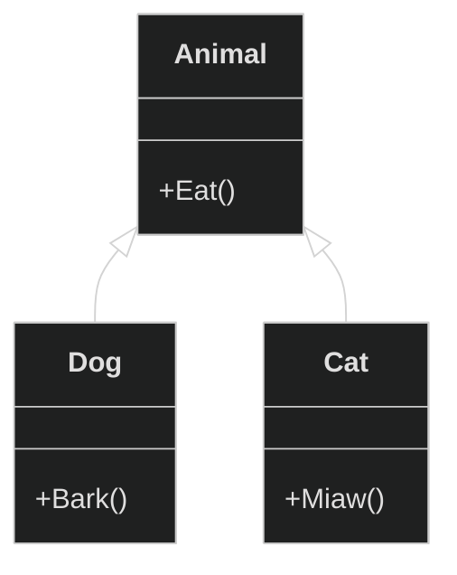
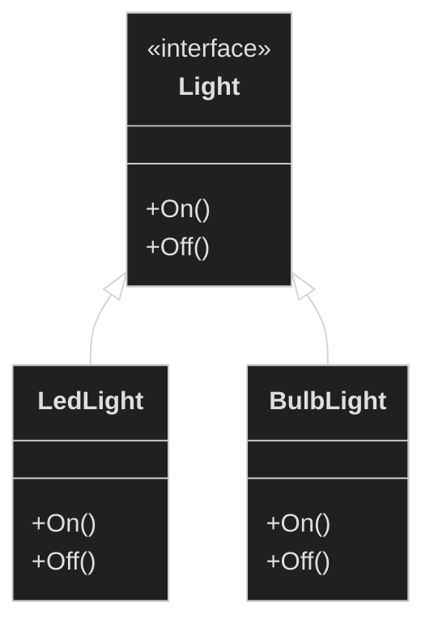
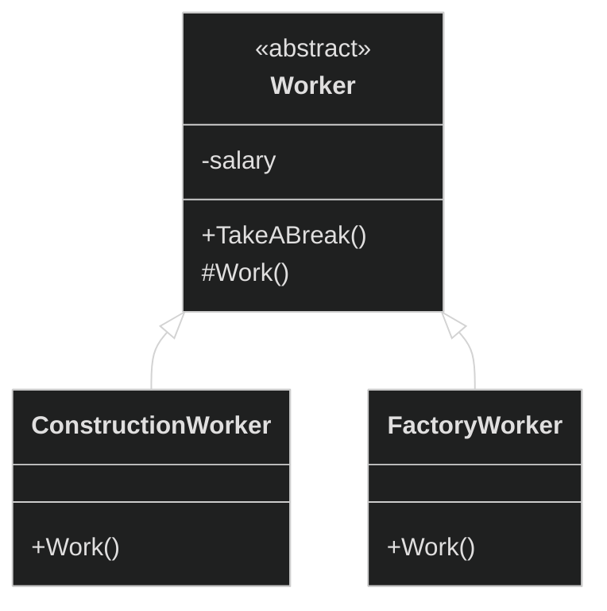
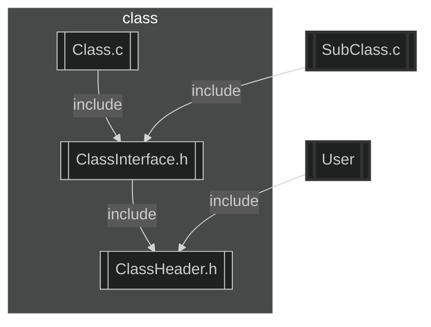
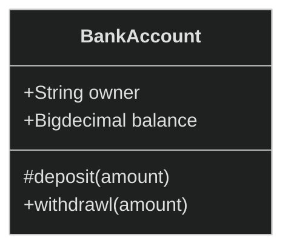
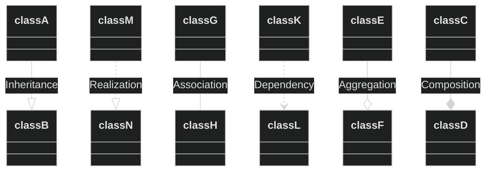
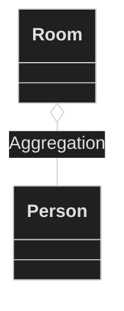
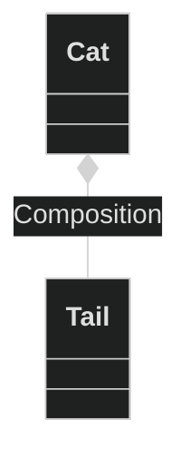

- [1. Object-oriented in C](#1-object-oriented-in-c)
  - [1.1. class in C](#11-class-in-c)
    - [1.1.1. Encapsulation](#111-encapsulation)
  - [1.2. inheritance](#12-inheritance)
  - [1.3. interface](#13-interface)
    - [1.3.1. interface in C](#131-interface-in-c)
  - [1.4. abstract class](#14-abstract-class)
    - [1.4.1. implementation in C](#141-implementation-in-c)
  - [1.5. access rights](#15-access-rights)
    - [1.5.1. the 2 files header access right strategy](#151-the-2-files-header-access-right-strategy)
  - [1.6. Unified Modeling Language (UML)](#16-unified-modeling-language-uml)
    - [1.6.1. UML for Class Diagram](#161-uml-for-class-diagram)
    - [1.6.2. Association distinction](#162-association-distinction)

# 1. Object-oriented in C
Standard C is a procedural programming language. The program focus is to break down task into variables, data structures and subroutines. In contrast of the object-oriented programming, the break down of a task is done to expose behavior (method) and data (members or attributes) using interfaces. With procedural programing, we use procedures to operate on data structures whereas in object-oriented the two are bundle together. Object combines methods( procedures) and attributes( data structure). An object is an instance of a class and operates on it's own data structure.

| procedural     | Object-oriented |
| -------------- | --------------- |
| Procedure      | Method          |
| data structure | Object          |
| Module         | Class           |


## 1.1. class in C
When we write a class in C++ we define the method, the attributes and their access right.

```cs
class Dog
{
  // Everything that is access publicly
public:
  void Eat();
  void Bark();
  //Everything private and not aceessible
private:
  int weight;
  string name;
  int nblegs;
};
```
To reproduce a class in C we exploit struct type and function pointer. The class attribute can be represented by a structure.

```cs
typedef struct dog_s{
  int weight;
  char* name;
  int nblegs;
} dog_t;
```
The method of a class are function pointer that are contain in a structure.
```cs
typedef struct dogMethod_s
{
    void (*Eat)(void);
    void (*Bark)(void);
} dogMethod_t;
```
Object are a a combination of function and data structure so we combine both to create our class `dog`.
```cs
typedef struct dog_s{
  int weight;
  char* name;
  int nblegs;
  dogMethod_t* methods;
} dog_t;
```
We have now a way to represent a class in C. To complete the class we need to associate the implemented function for our class to the function pointer.
```cs
void _Bark(void)
{
  print("bark);
}
void _Eat(void)
{
  print("Eat");
}
static dogMethod_t _methods = {
  .Bark = _Bark,
  .Eat = _Eat
};
void dog_init()
{
  dog.method = &methods;
  //..
}
```
### 1.1.1. Encapsulation 
Classes uses keyword `public` `private` to indicate the access level of it's carateristic. [the section about access right will follow with more detail](#15-access-rights). To make sure user don't access the structure parameter, we define it's variable in the source file.
The header file will only contain a forward declaration to our type (class). This is known as **encapsucaltion** and will make sure the object is used as a black box.

In the header file we declare a pointer type to our structure. the compiler will then know of it's existence but ony as a pointer therefore cannot access it's containt.
```cs

typedef struct dog_s * pDog_t;
```

In the source file, we declare our structure and it's containt.
```cs
typedef struct dog_s{
  int weight;
  char* name;
  int nblegs;
  dogMethod_t* methods;
} dog_t;
```

## 1.2. inheritance
The inheritance mechanism is a object-oriented feature for basing object on other object. An object parent can pass on his implementation to his children. For example We can have an Animal class( the parent class) and derive new subclasses (children) to share similar functionality.
<center>



</center>

In our example the Animal class is the super class. The dog and the cat derive from animal and extend it's behavior. Children will acquires  all the property and behavior of it's parent class. inheritance is commonly used to establish a *is-a*  relationship. In our example we can say Dog *is-a* Animal. In C we can achieve inheritance by making the first object of our structure the class it derives from.

```cs
typedef struct animal_s{
  int weight;
  animalMethod_t* method
} animal_t;

typedef struct dog_s{
  animal_t super;
  char* name;
  int nblegs;
  dogMethod_t* methods;
} dog_t;
```
We now can typecast our dog as a Animal and use the animal class methods.
```cs
pAnimal_t animal = (pAnimal_t)dogInstance;//dog is an animal
Eat(animal);//we can reuse the animal function
```
In C++ a class has do designate what property or methods can be accessible to the child class. C++ uses the keyword `protected` to indicate that the access to underliying attributes/methods can only be accessible to derived class. [In the following section](#151-the-2-files-header-access-right-strategy) We will explain a C strategy for protected access right.

In C++ once we define a class we can instanciated it's object. We can then call it method like this
```cs
Dog fido;//instance object of class Dog
fido.Bark();//object fido is a dog and can bark
```
The line `fido.Bark()` traduction to C would be `Fido_Bark(self)` `self` or `this` means the same thing which is a definition the its own structure. In C++ the compile make the traduction for us. We do it ourself here instead.

## 1.3. interface
An interface is similar to a class but it's methods are not implemented. Interface cannot be instanciated they can only be inherited by a class. We say that classes that derive from interfaces are concrete classes. When a class implements an interface, it inherits its abstract methods.


| interface                                               | class                                                    |
| ------------------------------------------------------- | -------------------------------------------------------- |
| contains behaviors that a class implements              | describes attributes and behavior of an object           |
| contains only abstract methods                          | contains abstract methods, regular methods and attribute |
| can be instanciated via a concrete class implementation | can be instanciated                                      |
| all access are public                                   | class has a mix of public and private access rights      |

The following exemple demonstrate how class can inherit form interface.

<center>



</center>

We have an interface Light. We know light can be turn on or off. On and Off are abstract methods that are not implemented. Our concrete class are LedLight and BulbLight. They inherit Light and implement the On and Off methods. LedLight and BulbLight know how to turn the Light on, They will each turn the light in their own way. From the user prespective, We only care about seen having light when we turn a light on. The user can swap a Led light to a bulb light and can still use it to say read his book in the dark.

### 1.3.1. interface in C
It's is very simple to create interfaces in C. We only need to leave the the method emtpy. When dealing with abstract method we call our method a table of virtual functions  (`vtable`). 
We define our interface as follow:
```cs
//the forward declaraction our Light should be public, therfore declared in the header file
typedef struct light_s * pLight_t;

typedef struct lightInterface_s * pLightInterface_t;
typedef struct Light_s
{
  pLightInterface_t vtable;
}action_t;

typedef struct lightInterface_s
{
  void (*On)(pLight_t);
  void (*Off)(pLight_t);
} lightInterface_t;
```
Once we have our interface define we can inherite from Light and implement it's vtable.
```cs

struct LedLight_s
{
  light_t  super;
  //defines the rest of the things needed to make the light turn on/off 
};

static void _On(pLight);
static void _Off(pLight);
static lightInterface_t _interface = 
{
    .On = _On,
    .Off = _Off,
};

```
## 1.4. abstract class

Abstract class and interface share some similarity were they both cannot be instanciated. With interface we mearly define functionality, there is no implementation by default or function extension. On the other hand, abstract class can offer some functionality by default. A subclass can implement the or override some of these functionality. A subclass of an interface has to implemented the defined functions.

An example of an abstract class:


Our `Worker` abstract class in this example already implement `TakeABreak` All worker basically do the same thing when taking a break which is not to work. The Work method is abstract and need to be implemented by all concrete worker because they all differ with what they do as a job. 

Abstract class can also implement all it's method but allow for overriding them. Or they can offer to implement only private method. 

### 1.4.1. implementation in C
We use the same strategy with the interfaces. The only difference is that we offer an initialisation that can set default methods for our class.

```cs

//the forward declaraction our Light should be public, therfore declared in the header file
typedef struct worker_s * pWorker_t;

typedef struct workerInterface_s * pWorkerInterface_t;
typedef struct worker_s
{
  int salary;
  pWorkerInterface_t vtable;
}action_t;

typedef struct workerInterface_s
{
  void (*TakeABreak)(pWorker_t);
  void (*Work)(pWorker_t);
} workerInterface_t;

//in the source file.
static lightInterface_t _defaultInterface = 
{
    .TakeABreak = _TakeABreak,
};

```


## 1.5. access rights
When dealing with class in C++, we often limit the access to attributes or method with the use of the keyword `private` and `public`. In C what is private is often what we find in the source file like `static` variables and functions. Public methods and attributes can be accessible when defined in the header file. We can encapsulate our object structure [with forward declaration](#111-encapsulation). This way user cannot acess directly to the structure elements. 

### 1.5.1. the 2 files header access right strategy
When dealing with interfaces and inheritance in general, it is difficult to set the private and public parameter to our class in C. To solve the issue of heritage access for child classes we come up with the 2 header file strategy that allow use to separate what is heritable ( accessible to only derive class) and what is accessible to all. 
When we describe a class, we create 3 files in total.

1. The Source class file that contains implementation and anything private
2. The Header class file that contains the public methods
3. The Interface Header class file that contains the protected method and the protected

The include scheme between the 3 files are describe below.

<center>



</center>

`ClassInterface.h` will contain anything protected and only available to subclass. Make sure this file is not available to anyone expect the class that will implement the interface or the abstract class.
```cs
#include "Class.h"

typedef struct classInterface_s * pClassInterface_t;
typedef struct class_s
{
    super_t super;//an inheritance if we have one
    pClassInterface_t vtable;
}class_t;

typedef struct classInterface_s
{
    void (*Method)(pClass_t);
    void (*PrivateMethod)(pClass_t);
} classInterface_t;

//only subclass can have access to the private method and implement it.
void PrivateMethod(pClass_t self);

```

The `Class.c` souce code will include the Class interface to have access to the private parameters and the `vtable`. 

```cs
#include "ClassInterface.h"
//this is not an implementation but only the call to the implementation.
void Class_Method(pClass_t self)
{
  //Will only call the vtable method
  self->vtable->method(self); 
}

```
The Class header file `Class.h` will only have what will be accessible to the class users. Will also need to forward declare the object type. <span style="color:#ff726f">Do not include the classInterface header in the header folder!</span>.
```cs
typedef struct class_s * pClass_t;
void Class_Method(pClass_t);
```
A user will only include `class.h` header file and use only what is available to him.
A concrete or subclass will include `classInterface.h` to have access to all availble method and structure data. If we want method, data to be private we only define them in the `class.c` file.

The Framework offers [code generating tools](framework-guideline.md) to automaticaly handle the 3 file strategy with proper syntax.

## 1.6. Unified Modeling Language (UML)
Whenever we are designing an architecture, We have to describe the code and it's implementation with a standarise fashion. Just like we draw schematic to describe a electronic circuit, We draw in a standard way to describe the code. Through out this document we describe class relationship by using the stardard UML. UML is a drawing modeling language use to efficiently visualize a system design.


<figure>
  
  <figcaption>Example of a UML diagram.</figcaption>
</figure>

### 1.6.1. UML for Class Diagram

UML scope is large, We will focus on UML for class diagram. Class Diagram describe the structure of a system by showing the system's classes, attributes and methods. "Wikipedia"

We describe an class in UML by representing it's attributes and methods with 3 compartments
 - The Top compartment will indicate the class name
 - The middle compartment contains the attributes 
 - The bottom is resever for methods.

<center>



</center>

To indicate the access right on the class element, UML use the following notations;
+ `+` Public
+ `-` Private
+ `#` Protected

Class interact with other class. The relationship between different classes are done with line connection between classes. UML notations for classes relationship are describe here


|Type  |Description  |
|---------|---------|
|Inheritance  | Repesents the `is-a` relationship, `classB` is a specialization or a specific class of `classA`.       |
|Realization     |Is the relationship between interfaces and their implementation. `classM` is the interface. `classN` realise (implement) `classM`.  |
|Association     | Were class interact with another class. We typiccaly use verb do describ the relationship. `classG` uses `classH` if there is no arrow, it means they both interact with one another. A arrow will indicate a on relation were only one knows about the other.       |
|Aggregation     | A type of association, were the ralationship is describe as "part of". `classE` is part of `class F`.         |
|Composition     |  A special type of Aggregation where the object takes possession of the other. `classD` is composed of `classC`. When `classD` is destroy `classC` is aswell.       |
|Dependency      | A special type of *association* were if the definition changes for `classL`  the the other class has to change. `classK` depends on `classL` |

### 1.6.2. Association distinction
Considere the relationship with a pets and it owner.

- owners feed pets, pets please owners (association)
- a tail is a part of both dogs and cats (aggregation / composition)
- a cat is a kind of pet (inheritance / generalization)
  
When dealing with Aggregation and Composition, The differences between both are subtile but important. Both relationship means that an objectA "owns" objectB of which he is associate with.
But the difference are the following:
- Aggregation means thate the child object can exist independently of the parent. Ex. We can delete the room but the Person still exits.
<center>




</center>

- Composition means that the child is meaningless without it parent. Therefore, when the parent is deleted the child is also deleted.

<center>



</center>


[More detail on the Association relationship](https://www.visual-paradigm.com/guide/uml-unified-modeling-language/uml-aggregation-vs-composition/).
