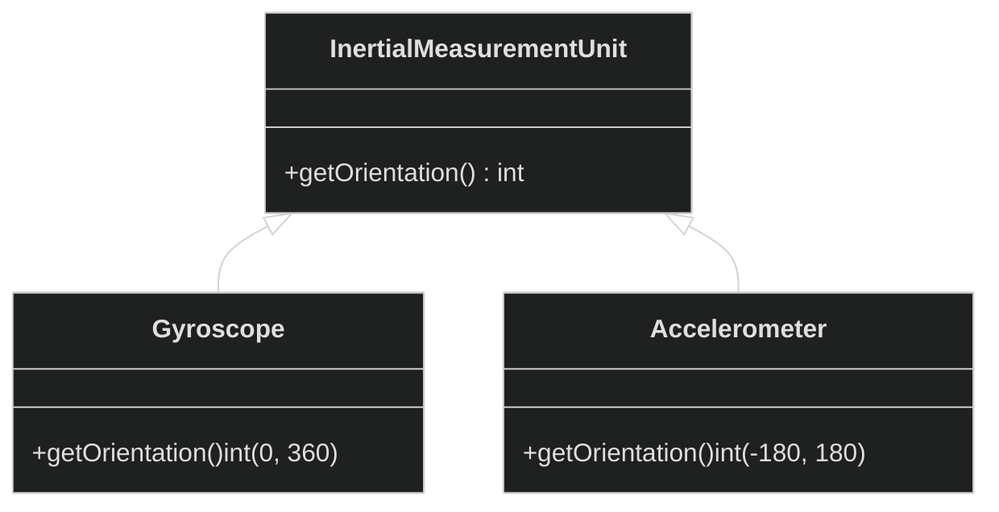
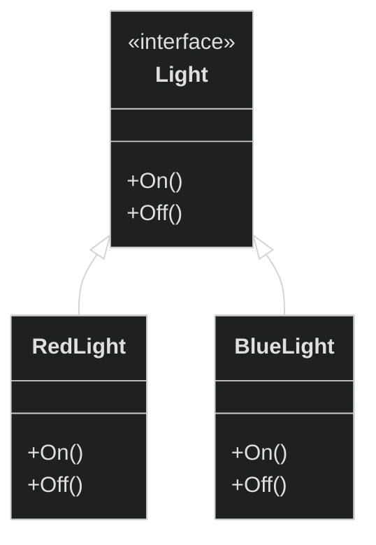
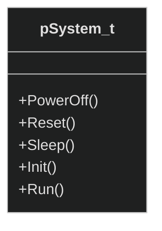
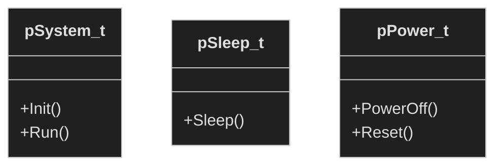
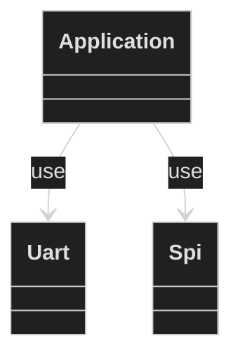
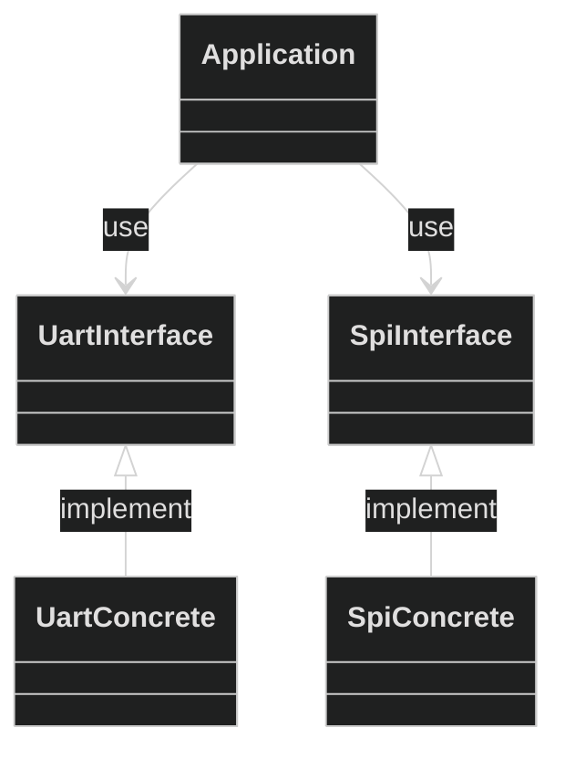

- [1. Solid Principles](#1-solid-principles)
  - [1.1. Single responsibility (SRP)](#11-single-responsibility-srp)
  - [1.2. open/close (OCP)](#12-openclose-ocp)
  - [1.3. Liskov substitution (LSP)](#13-liskov-substitution-lsp)
  - [1.4. Interface segregation (ISP)](#14-interface-segregation-isp)
  - [SRP vs ISP](#srp-vs-isp)
  - [1.5. Dependency inversion](#15-dependency-inversion)

# 1. Solid Principles
We often hear of the solid principle in object-oriented programming. But in reality, it's more of a philosophy for methodologies. SOLID is an acronym that stands for 5 principles that we will describe below. These principles are designed rules to make a software more flexible and maintainable. They are the most efficient way to combat [code smells](code-smell.md).


## 1.1. Single responsibility (SRP)
This principle means that a class or module should have a responsibility for one reason or purpose.
The module should only have **one reason to change**. A reason can mean the change in the requirement.
A simple example that violate this principal is to have a module that depend on 2 object in order to do 2 different things.
```cs
Logger_Print(msg)
{
  char* msg[100];
  sprintf(msg, "[%s][%d]:Debug message %s", date, line, msg);
  Uart_Send(msg, 100);
}
```
In this example we have the single responsiblity priciple violated. Not only is the logger responsible for the uart transmission but is also responsible for formating the message.
Logger has 2 reason to change
- 1. A change in the log formating
- 2. A change in the media of transmission.

## 1.2. open/close (OCP)
This priciple implies that the code is open for extension but close for modification. We can allow for new functionality to extend the code without having to change the existing code.
The best way to apply this principle is by using polymorphism. The use of [interfaces and abstract](object-oriented.md) classes will allow the code to be able to extend its functionality.

Usually when there is a switch case statement, this priciple is violated.
```cs
enum {
  UART,
  SPI,
  I2C
}eTransmitMode;

Transmit(msg)
{
  switch{
    case UART:
      Uart_Send(msg);
    case SPI:
      Spi_Send(msg);
  }
}
```
Whenever we need a new mode of transmission we have to change the Transmit function. The switch case will repeat itself for every other functionality of the uart, spi ...
We end up always returning to the code and changing multiple switch cases.

## 1.3. Liskov substitution (LSP)
The Liskov substitution principle deal particularly with [inheritance and object interfaces](object-oriented.md).
The principle stipulates that if object B is a subtype of object A, then B can be replaced with A without altering any property of the program.
In other words, the parent and the child class should behave in exactly the same way from the user level perspective.



We cannot substitue Gyroscope with Accelerometer since they dont return the same range. This violate the Liskov principle.

Another exemple of Liskov violation is to redefine our example in [interface section](#23-interface). We have defined a light object With concrete implementation LedLight and BlubLight. Let say that instead we say that reimplement Light with RedLight and BlueLight.



Substituing a red light to a blue light is not exactly the same thing. The behavior change from one light to another.

## 1.4. Interface segregation (ISP)
This principle advocates for creating small interfaces with single purpose. It is better to have several single purpose interfaces than one interface with multiple purposes. This will allow for more customization. Interface segregation implies that we should not have methods that are unused.
For exemple take the class name `system` where it is responsible to dealing with controlling the state of a given firmware environment.


We can see that we have a `system` interface that will be run from the main application. We can turn off the `system` and we can put it into sleep. The `System` interface is large and can potentially get larger. As system differ from one firmware to another and some can have more feature and other less. The indication that the Segregation priciple is violated are sub class of `system` that will have an empty implementation. For example , we can deal with an MCU that doesnt sleep. We only statisfy the method without a meaningful spacialization. 

The solution is to divide `system` into different atomic interfaces.


In the end, ISP tells us that you should not be forced to be confronted with more than what you actually need.

## SRP vs ISP

ISP generalizes into: “Don’t depend on more than you need.” SRP generalizes to “Gather together things that change for the same reasons and at the same times.”
If you want to use a print() method from an interface, you shouldn't have to instantiate a SwimmingPool or a DriveThru class for that.

More precisely, they are different views on the same idea -- SRP is more focused on the designer-side point-of-view, while ISP is more focused on the user-side point-of-view.


Imagine a stack class with both push and pop methods. Imagine a code that only use the push method. If the user's code uses the stack interface, its code will be linked to the pop method but it does not need it. SRP would not separate push from pop; ISP would.


## 1.5. Dependency inversion

This principle stipulates that high level modules should **not** depend on low-level modules. Both high and low levels should depend on abstraction/interfaces. The abstraction class and interfaces should not depend on concrete classes and concrete classes should depend only on abstractions.
When we usually create our architecture layout, we often make the mistake of having the high level application logic dependent on some low-level component that contains a specific logic.



`Application` use `Uart` and `SPI` for its specific logic. The application won't be reusable in other environments or products. 

We need to abstract the essence of the low level component into an interface. Then, we follow our principle of dependency inversion and make Uart and SPI interfaces. 


