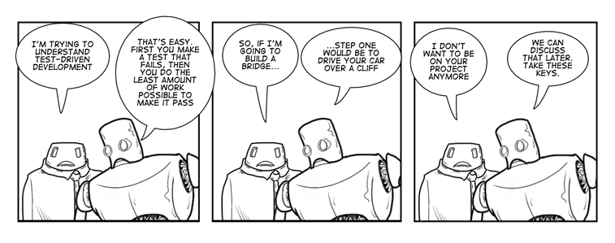
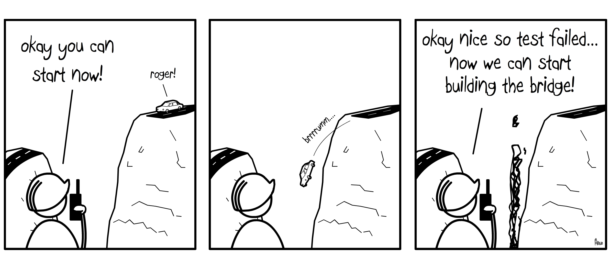
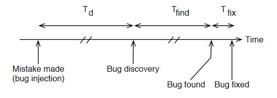
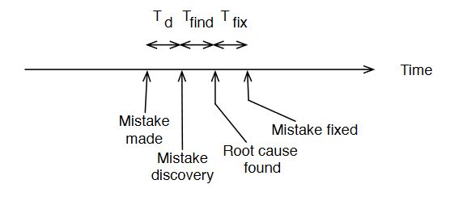

- [1. Test Driven development (TDD)](#1-test-driven-development-tdd)
  - [1.1. What is TDD](#11-what-is-tdd)
    - [1.1.1. TDD cycle](#111-tdd-cycle)
    - [1.1.2. Benefits](#112-benefits)
  - [1.2. TDD tools](#12-tdd-tools)
      - [1.2.0.1. Ceedling](#1201-ceedling)
  - [1.3. Starting with TDD](#13-starting-with-tdd)
    - [1.3.1. Establish the needs](#131-establish-the-needs)
    - [1.3.2. Don't let the code get ahead of the tests](#132-dont-let-the-code-get-ahead-of-the-tests)
    - [1.3.3. TDD state machine](#133-tdd-state-machine)
  - [1.4. Why TDD?](#14-why-tdd)
    - [1.4.1. We dont't have time](#141-we-dontt-have-time)
    - [1.4.3. Why not write test after the code?](#143-why-not-write-test-after-the-code)
    - [1.4.4. We still have to maintain the tests](#144-we-still-have-to-maintain-the-tests)
    - [1.4.5. TDD doesn't find all bugs.](#145-tdd-doesnt-find-all-bugs)

# 1. Test Driven development (TDD)

**Note**: *Referenced and inspired by the popular book by James W. Grenning. [Test-Driven Development for Embedded C](https://www.amazon.ca/Test-Driven-Development-Embedded-C/dp/193435662X),*

Most of the time when we start coding we develop our code until we are done and then we cross our fingers and hope there is no bugs. But bugs always happens, they can show themselves fast if we have automated bench tests or a QA departement or they can take their time when the client is trying to make the product work and is confused, but they are always there. So we debug and fix. The workflow is linear, from developement to Test and debugging. 

<figure>
  
  <figcaption>DLP workflow.</figcaption>
</figure>

When we think of testing, we think of doing it once the code is done. We could spend about half or sometimes more of the developement time in the unpredictable and chaotic activity of debugging. We sometimes fix a bug by introducing another one without knowing. We sometimes fix bugs and old bugs that we fix before reapear.
It doesn't take time before we start tinking about automated test so we can find bugs quickly rather than letting them be discovered during release or rush times. We spend tremendous ressources and effort to create a complicated system that will barely indicate use that a bug exist somewhere. Automated test themselves are developed and we find ourselfs in the same cycle. We find ourself debugging the automated test. 
" maybe we should have automated test for the automated tests" - Inception movie fan

Some people had insight on the issue at hand. 
" what if we have shorter cycles of developement" - brilliant guy.
Yes, indeed reducing the cycle will lead to less problems. Without the need of an army of testers and agressive test automation. If we focus one one feature at a time we can detect reduce the debug sessions.
This section will give you the miracle solution to all this, It called Test Driven Development (TDD).

## 1.1. What is TDD

TDD is a development technique for writting code incrementally. It's simply state that we first write a failing unit test code before we write the production code. Tests are small, they are automated and they express the production code functionality. Instead of diving into the production code and leaving testing for later, TDD drive us to the opposite. We express the desired behavior first by writing the test for it. We make our test fail and then we write the code to make it pass.
Unit test follow the production code and is as valuable as the production code itself. With every change, the test runs and check for the new code's function but also check for all the rest of the existing code for compatibility.

Software is fragile and any change can introduce new bugs. We can't afford to test everything manually when the product evolve and grow and end up with thousand of features. The cost of retest can be extremely high at times.

TDD is not a testing technique. It a development strategy. TDD is like a game of 2 concurrent player were one try to make the other player code crash and fail. When writing TDD, we split our mind into 2 entities and we make them fight each other. TDD bring a feeling of progression whenever a test is complete. 


### 1.1.1. TDD cycle
TDD differs heavily from the traditional *Debug-Later-programming* (DLP). With DLP, the code is tested once "done". But we all known that nothing is actually done when we are about half through since nothing is tested. The feedback revealing those bugs may take days, weeks or even months (once you have complete forgot the project). With late feedback other changes piles on the broken code and we find ourself with more time debugging. We become bug hunters. **Being good at chasing bugs is not technical excellence**. 
TDD and DLP is like driving to a place, we have 2 route option, one route seems fast but hide traffic. The other seems slow but with no traffic.

| TDD                                               | DLP |
| ------------------------------------------------------- | ---------------- |
| Steady Pace             | Spurts ( burst)         |
| Speed limits                          | Fast when no problems|
| No traffic lights |Debugging                                     |
| Might feel slow                                   | Feels fast, but often slow     |


TDD is not about spending hours or days on writing masses of test code! Then follow with the production code. TDD is about writing one small test, follow by writing just enough code to make the test pass, while breaking no exisiting test. With TDD you write what you want before you build it. The core of TDD is micro cycles of very small steps. Each pass provides feedback and tells us if the new and old code behave as expected. TDD cycles steps are describe as follow:
1. Add a small test
2. Run all the tests and see the new one fail, or even not compile
3. Make the small changes need (bare minimal) to pass the test
4. Run all the tests and see the new one pass.
5. Refactor and improve readability, duplication or expressiveness.

The Test follow the code development and feedback is immediate.

<figure>
  
  <figcaption></figcaption>
</figure>

### 1.1.2. Benefits
TDD take times to get use too. But comes with tremendous benefits,
- Fewer bugs: they are found quickly during TDD microcycles.
- TDD documents the code. Well-structured tests becomes a form of code documentation.
- Improve design. Good design are testable. With TDD we are less prone to write long functions, tight coupling and all the [code smells](code-smell.md).
- Rewarding: there is an instant gratification for developers every time you code something done right.
- Reduce risk by verifying production code that is independent of the hardware.
- Reduce the long target compilation by having less debugging on hardware.
- Isolate the hardware/software interaction by modeling the hardware in the tests.
- Improve module decoupling and hardware decoupling. Testable code has to be modular.


## 1.2. TDD tools
TDD relies on automation. We write our test procedure on a PC. We compile the tests along with the production code toghether. Both will evolve in the same environement. We can write our test bare metal using whatever compiler and writting the whole test code ourselfs. It is preferable though to use a Unit Test Harness. 

Unit Test Harness is a software package that comes with a variaty of test capabilities. It's job is to provide:
- a common language to express test cases, 
- to express results,
- Collect all the unit test cases for the project.
- Mechanism to run the test cases in partial or in full.
- Produce report of th test suite


#### 1.2.0.1. Ceedling
Ceedling is a Test Harness that is fairly easy to use and can provide all the essencial tools to start writing our unit tests.
ADS's environement will provide the script to run the test and produce the needed results. The project repo should contain the following
1. The source folder `src/`
2. The test folder `test/`
3. yml ceedling project setting `project.yml`

Once we have all setup, we can look at what does a unit test look like.
```cs
////////////////////////////////////////////////////////////////////////////////
/// @file       ./test/test_OurFirstTest.c
////////////////////////////////////////////////////////////////////////////////

#include "unity.h"//ceedling is based on another Test Harness called Unity.

//include whatever module that need to be tested and it's dependance.


// setUp function is call first for every test
void setUp(void)
{
}

//tearDown is call last for every test
void tearDown(void)
{

}
// our actual test
void test_OurFirstTest(void)
{

}
```
The name of the folder need to start with the prefix defined in the `project.yml` file. 
```cs
  :test_file_prefix: test
```
Usually the prefix is `test` so we have to make sure the test file prefix is `test` and every test function prefix is `test_`.
To run a test simply execute in you terminal
```
ceedling
```
Ceedling will automatically find all instance of unit test and execute them. If we need to be more specific about what test file to execute we do.
```
ceedling test:_OurFirstTest
```
Ceedling provide a lot more option that can be found at there [project repo](https://github.com/ThrowTheSwitch/Ceedling/blob/master/docs/CeedlingPacket.md).

Ceedling is based on unity Test Harness and provides all the commun assert known like
- TEST_ASSERT_EQUAL: will compare 2 integer an report the the assert.
- TEST_ASSERT_EQUAL_STRING: comapres 2 string and remote the statement.
- ... 

Let's write an example of a test for `sprintf`
```cs
void test_WhenSprintF_ShouldReturnStringLen(void)
{
  char out[5];
  TEST_ASSERT_EQUAL(3, sprintf(out, "hey"));
}
```
A test should always be short and focused. We simply check that the return of `sprintf()` return the right string lenght.
When we run our test we get the following result:
```
-----------------------
1 Tests 0 Failures 0 Ignored
OK
```
If we make the test fail,
```cs
void test_WhenSprintF_ShouldReturnStringLen(void)
{
  char out[5];
  TEST_ASSERT_EQUAL(4, sprintf(out, "hey"));
}
```
the failure result will look like this
```
test_WhenSprintF_ShouldReturnStringLe:45: FAIL
Expect 4 was 3
-----------------------
1 Tests 1 Failures 0 Ignored
OK
```
There is 4 phases with writing tests
1. Setup: Establish the preconditions to the test.
2. Exercise: Do something to the system
3. Verify: Check the expected outcome.
4. CleanUp: return the system under test to it'sinitial state.


## 1.3. Starting with TDD

<figure>
  
  <figcaption></figcaption>
</figure>
[To experience TDD with the Framework check out the step by step example](framework-guideline.md).

It is important to follow precise steps when doing TDD. For every given project we always start by defining and express concisely the need and the requirements.
Let's define together an example of a list for a Led driver module with TDD. So we have a hardware with an Micro controller and some LEDs are connected to it's pins. We want to use those led to communicate status or play animations.

### 1.3.1. Establish the needs
Before we start anything, the first step is to define our need and express concisely our Led driver requirement.
1. Our led Driver can turn on or off any individual LED without affecting others.
2. LED driver controls 16 LEDs
3. The driver can turn all LEDs on or off with a single interface call.
4. The user of the driver can  query the state of any LED.
5. ...
  
We focus on what the LED is suppose to do. We also describe how the driver will interact with the hardware. In addition to the requirement we also have to make sure our driver is testable without the hardware.
Before start, we need to also to write down the test we need. We have to write a test list.
* LED Driver Tests:
  - All Led are off after the driver is initialized
  - A single LED ca be turn on/off
  - Multiple LED can be turn on/off.
  - ...
The test list is different from the requirement list. It will define your best vision of what need to be done. It doesn't need to be perfect, It temporary on a notepad or anything. It should only take a couple minutes to write.

### 1.3.2. Don't let the code get ahead of the tests
Sometimes incomplete implementation can be bothering. Always make sure to have a test written for every possible line of code. The test should drive your code and not the other way around. Follow these 3 simple rules when doing TDD
1. Do not weite production code unless it is to make a failing unit test pass.
2. Do not write more of a unit test than is sufficient to fail. and build failures are failures.
3. Do not write more production code than sufficient to pass the one failling unit test.

We find ourself hard-coding production code and it feels like nothing is tested. The point is not to test but to drive our design.


### 1.3.3. TDD state machine
TDD is like working through a state machine. Each step of the way, you are focused on solving one specific problem.

<figure>
  
  <figcaption>From TDD embedded book.</figcaption>
</figure>


## 1.4. Why TDD?
Our main goal is to write code that is bug free. Let's compare the TDD approach to it's concurrent the DLP.
<figure>
  
  <figcaption>From TDD embedded book.</figcaption>
</figure>

With Td we let the bug live longer. As \(T_d\) increase \(T_{find}\) increase as well. If a bug take time to apprear, it also mean that it is difficult to reproduce and fix. \(T_{fix}\) usually doesn't take time but something it does. We can see that with TDD it's the other way around. Since we plan to find the bug in the first place we make the bug live a very short live.
<figure>
  
  <figcaption>From TDD embedded book.</figcaption>
</figure>

If you are going to fail, **fail fast**! TDD forces the developer to think about hi code before writing, this process catches mistakes before they become bugs.


### 1.4.1. We dont't have time

"From TDD book"
We all need more time. Where will we find time to write all this test code? There is barely enough time to write the  production code we need. There are more lines of test code than production code! But does that really matter? If people programmed error-free and at a constant rate, then there is some reason for concern. But people do neither.The time-consuming parts of programming are thinking, problem solving, and confirming solutions. Confirming solutions can  be done many ways, DebugLaterProgramming(DLP)or TDD to name two. The important question is, did writing the test impede or speedy our progress? Many proficient practitioners proclaim that TDD makes them go faster. They report a productive and sustainable pace.The speed up comes from reducing current and future debug times,and from having a [cleaner code](code-smell.md) base with tests as executable documentation. What if TDD takes a little more time?There are other costs besides development time:
- customer dissatisfaction,
- lost sales, 
- warranty repair,
- defect management,
- field service...

the list goes on. If you look only at the time it takes to get the production code written, you are not looking at the whole job.

### 1.4.3. Why not write test after the code?
"From TDD book"
The purpose of TDD is to have the test driven and influence. We make purposely small mistake and we fix them immediattely.

It’s hard to shift from DLP to TDD,and  this is a common reaction:“Let’s just write the  tests after.”Thispractice has a name,Test-After Development.You will get benefit from writing tests after,but not as much benefit as letting tests drive your production code.Test-AfterDevelopment is about testing,where TDD is about much more.

### 1.4.4. We still have to maintain the tests

"From TDD book"
Yes, you will have to maintain the tests.When you don’t have tests, you don’t have to maintain them, but you do have to do  those tedious manual re-tests. You get  value from having the tests that makes the maintenance effort worth the investment.Tests have to be kept clean and expressive and free fromd uplication. It takes time to learn these skills. After you gain skill at TDD and   designing test cases, you will find   that tests do not have to be difficult to maintain.

### 1.4.5. TDD doesn't find all bugs.
"From TDD book"
It is true,TDD will not prevent all bugs, but that does not make a case for not doing TDD. I like to think of TDD as helping make really solid building blocks by  making sure each line   of code does what we expect. Having each block behave as intended makes it possible for  the  system to behave as needed.Y o u   will   still   need integration tests,acceptance tests,exploratory tests,and   load tests.TDD will   eliminate many of  the  problems so  that   the higher-level tests are  finding appropriate problems.Integration tests should find   integration problems,acceptance tests should show that the  code meets its  requirements,and   load   tests should help   determine whether the  system can  meets its  design limits.When changes occur,there will   be  implications at the  unit   test   level, and   the  TDD tests will help   assure changes have only   the  intended consequences.A single wrong bit  can  spell disaster for  software-controlled systems.Software is amazingly complex,and   mistakes are  amazingly easy to make.


